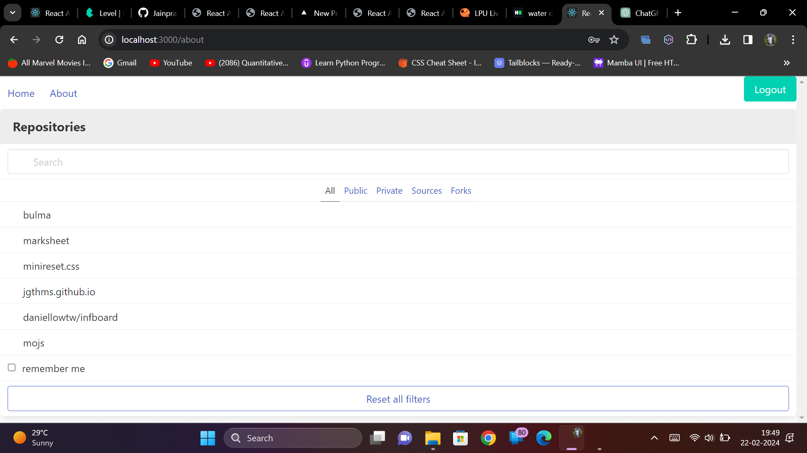
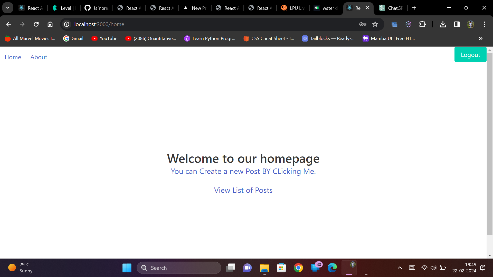

# React App with Routing and Components

## Assignment Overview

This project was created as part of the assignment titled "React App with Routing and Components." The objective was to build a React application with three components (Home, Navbar, and FormAction) and implement routing to navigate between these components. Additionally, a FormAction component was designed to gather user input.

## Components

### 1. Home
The Home component is responsible for displaying user details, including name, age, email, and address.

### 2. Navbar
The Navbar component serves as the navigation bar for the application.

### 3. FormAction
FormAction is a component that includes a form to collect user input. It features input fields for Name, Age, Address, and EmailID.

## Navigation and Routing

The application implements routing to allow seamless navigation between components. Routes are defined to render the Home and FormAction components based on user navigation.

## Screenshots

## Demo

Include screenshots or a video demonstrating the functionality of the application. Showcase the navigation between components and the input form in the FormAction component.

## Code Structure

Briefly explain the structure of your codebase. Highlight any key files or directories and their functionalities.

## Challenges Faced

Provide a brief overview of any challenges faced during the implementation of the assignment. This could include technical hurdles, design decisions, or any other noteworthy aspects of the development process.

## Submission

The React application codebase, along with necessary dependencies, is included in this repository. Screenshots and a demo video are also provided to showcase the application's functionality.

Feel free to explore the code and provide feedback or suggestions. Thank you for checking out this project!
